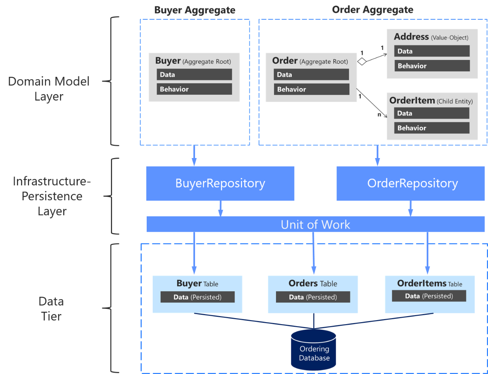

# DAO와_REPOSITORY_논쟁
> http://egloos.zum.com/aeternum/v/1160846

## 1) 시작은 EJB (Bean)
-  EJB(Enterprise Java Beans)는 Java의 ‘Write Once, Run Anywhere’ 모토를 엔터프라이즈 어플리케이션 환경으로 확장하기 위한 Sun의 야심작이다.
- 기본전략
    - 분산, 트랜잭션, 퍼시스턴스, 보안 등의 인프라스트럭쳐 서비스는 WAS(Web Application Server)가 제공
    - 개발자는 비지니스 로직에만 집중
- 구성요소
    1. `Entity Bean`
        - `Persistence Layer`
    2. `Session Bean`
        - `Domain Layer` (= `Business Logic`)
        - `CMT(Container Managed Transaction)`이 각광받으며 `Entity Bean`은 쇠락하고, `Session Bean`이 주도권을 가져감.

## 2) Session Bean에 침투하는 Persistence
Session Bean이 각광받으며 주로 쓰이다 보니, Entity Bean(Persistence Layer)에 있어야할 로직들이 도메인 Layer에서 혼용되기 시작하였다. 이는 EJB 철학에 위배되는 행위이기에 이를 해결하기위해 `DAO`가 등장하였다.

## 3) DAO
> Entity Bean(Persistence Layer)에 존재하는 SQL 의존성을 Domain Layer의 OOP에 맞게 캡슐화 시킨 객체
Entity Bean(Persistence Layer)가 사용하는 코드들은 `캡슐화` 시키고 이와 연결되는 `DAO` 인터페이스를 제공하여 `Domain Layer`에서 사용할 수 있도록 하였다. 

- 대부분의 프로젝트에서 TABLE DATA GATEWAY 패턴을 따라 테이블 별로 하나의 DAO를 만든다.
- Persistence Layer에 대한 FACADE(입구) 역할을 수행
## 4) 그럼 Repository는?
> DDD에서 Domain Layer OOP 컬렉션 

- DDD 개념(Domain, Repository, AGGREGATE ..)
- Domain Layer에 존재하는 컬렉션들을 OOP적으로 관리하도록 도와주는 인터페이스
- `AGGREGATE`
    - 객체간 생명주기가 종속되고, 불변식을 공유한다면 AGGREGATE
    - AGGREGATE : REPOSITORY = 1:1
    - REPOSITORY 객체를 두어 복수의 객체 컬렉션들의 묶어주고 생명주기를 관리한다.
- REPOSITORY에서는 이 AGGREGATE를 관리하는데, 이때 **이미 DB(Persistence)영역에서 모든 객체가 Update되었다고 가정하고 Life Cycle을 관리한다.**
- 실제 개발영역에서는 AGGREGATE의 생명주기관리를 위해서 Persistence에 접근해야 하는데, 이를 **`SEPARATED INTERFACE`**라고 하며, 인터페이스는 Domain Layer에 속하도록, 실제 구현부는 Persistence에 속하도록 하여 개발한다.

## 5) 결론: DAO vs REPOSITORY
- `DAO`
    - `Entity Bean`로직을 대체하고 Domain과 Persistence를 분리해주기 위해 등장
    - DAO의 인터페이스는 데이터베이스의 CRUD 쿼리와 1:1 매칭되는 세밀한 단위의 오퍼레이션을 제공

- `REPOSITORY`
    - 메모리에 로드된 객체 컬렉션에 대한 집합 처리를 위한 인터페이스를 제공 (객체 Life cycle 관리)
    - REPOSITORY에서 제공하는 하나의 오퍼레이션이 DAO의 여러 오퍼레이션에 매핑되는 것이 일반적
    -  따라서 하나의 REPOSITORY 내부에서 다수의 DAO를 호출하는 방식으로 REPOSITORY를 구현할 수 있다.
    - 참고로 Service를 통해서 외부 시스템과의 

- DAO는 `TRANSACTION SCRIPT 패턴`과 함께 사용된다. 반면 REPOSITORY는 `DOMAIN MDOEL 패턴`과 함께 사용된다. 
- 글 저자의 견해를 정리하면  

> 개인적으로 TRANSACTION SCRIPT 패턴에 따라 도메인 레이어가 구성되고 퍼시스턴스 레이어에 대한 FAÇADE의 역할을 하는 객체가 추가될 때는 거리낌 없이 DAO라고 부른다. 도메인 레이어가 DOMAIN MDOEL 패턴으로 구성되고 도메인 레이어 내에 객체 컬렉션에 대한 인터페이스가 필요한 경우에는 REPOSITORY라고 부른다.

## c.f) 인프라 지속성 계층(Design the infrastructure persistence layer)
> 아래의 그림을 보면 전체 계층에서 Repository와 DAO의 관계를 살펴 볼 수 있다.

- 
    - 출처: https://docs.microsoft.com/ko-kr/dotnet/architecture/microservices/microservice-ddd-cqrs-patterns/infrastructure-persistence-layer-design

- 
    - 출처: https://gmlwjd9405.github.io/2018/12/25/difference-dao-dto-entity.html