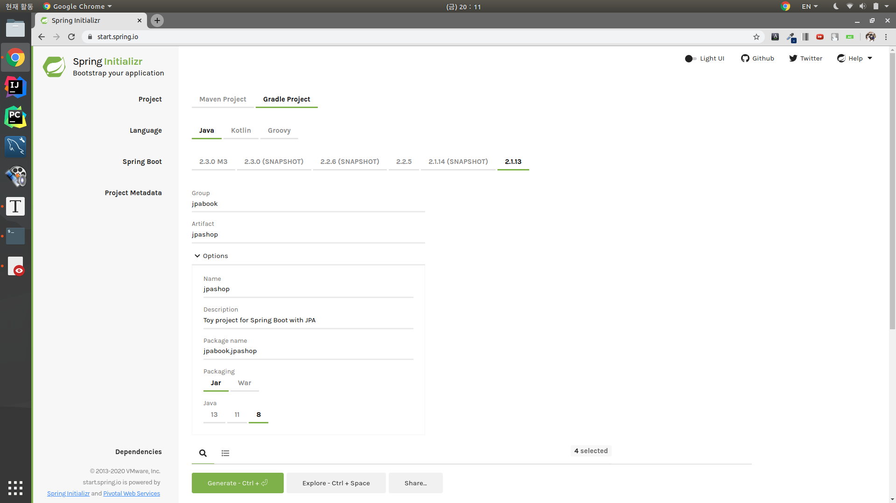
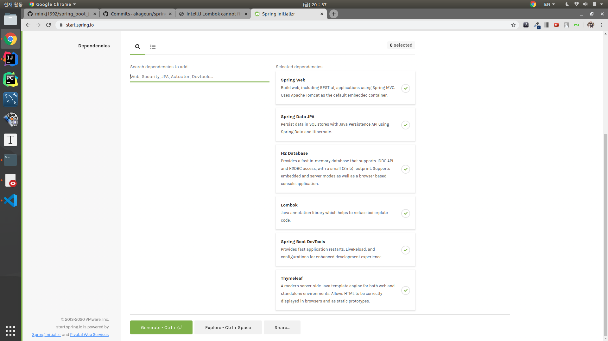
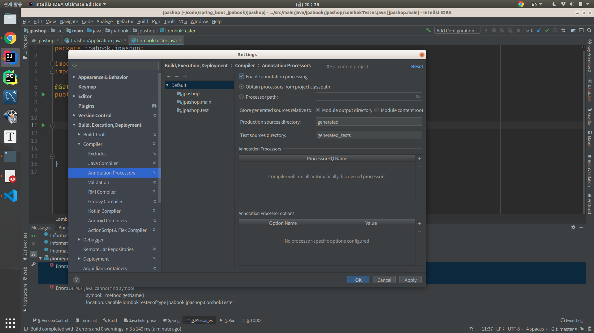
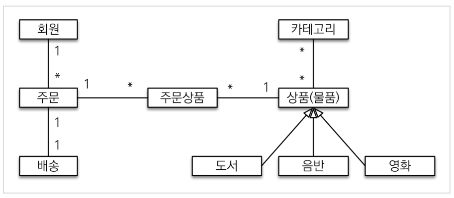
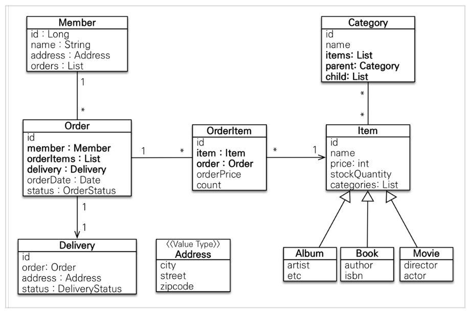
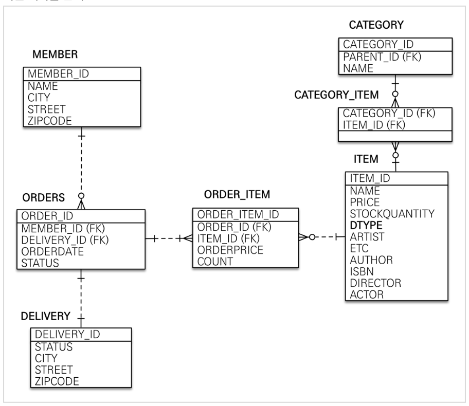
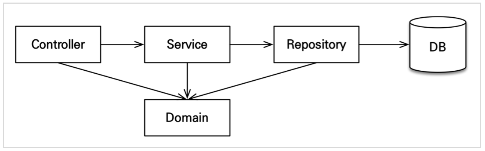

# JPABook
> SpringBoot + JPA + thymeLeaf + H2 DB

## **[1] 설계 원칙**
### 1. `Loosed Coupling & High Chesion`
1. 모듈간의 연관관계가 interface로 느슨하게 연결되어야 한다.
2. 어떤 목적을 위해 연관된 기능들이 모여서 구현되고 지나치게 많은 일을 하지 않는다.

이를 구현하기 위해 DDD(Domain Driven Design)의 몇가지 원칙을 적용하겠다.

### 2. `역할에 따른 Domain Model`
- Domain(Entity, VO)
    - Entity
        - JPA의 @Table과 매핑
        - Business Logic은 `Service`가 아닌, 상태값을 지닌 Entity가 구현하도록 한다. (`OOP에서의 객체는 상태와 행위를 가진다.`)
    - VO는 (Entity)Status와 같이 부가정보, 상태, 등급같은 Class, Enum을 활용
- Aggregate
    - CASCADE mapping을 활용하여 Aggregate 생명주기 관리한다.
    - 복잡한 Aggregate는 쪼개서 로딩 효율을 높이는 것 대신 JPA Lazy loading을 사용해 필요한 시점에 필요한 데이터들만 로딩되도록 하여 개발 효율성과 속도적인 우의를 가진다.
        - **`1+n query problem` 문제는 Fetch join과 JPA가 DTO를 바로 조회하게 해주어(select에서 검색하는 요소 최적화) 성능최적화를 시켜준다.**
- Service
    - 트랜잭션 처리
    - 도메인 간의 연산 처리
    - Repository들을 field로 둔다.
    - thin layer
- Repository
    - JPA를 직접 사용하는 계층
    - Domain 모델 저장
    - EntityManager를 field로 두어, Entity, Aggregate Life Cycle을 관리
    - `JpaRepository interface`를 상속한다면 Factory를 활용해 객체 생성
- Factory
    - Entity, Aggregate 생성

- c.f) DAO/DTO 개념은 `TRANSACTION SCRIPT 패턴` 개념에서 사용하는 용어로 `DDD`개념과는 다른 개념 용어이다.

### 3. `레이어별 Domain Model`
1. 우선 Context로 분리
2. 이후 Context안에 존재하는 Layer별 분리한다.
3. user_interface -> application -> domain -> infrastructure 순서로 layer가 나뉘며, 상위 레이어는 하위 레이어를 의존한다. (user interface는 모든 하위 레이어를 의존 가능하며, 반대로 infrastructure는 다른 레이어를 의존하면 안된다.)

- Layer 종류
    - interface
        - 역할 : User interface ( 사용자 요청을 하위 layer에 전달 )
        - @Controller
        - @Component
            - 응답 객체 Cache Service
    - application
        - @Service
            - 복잡한 비즈니스 로직
            - Domain 조합 
    - domain
        - JPA의 Entity (비즈니스 로직)
        - Factory
    - infrastructure
        - 외부 통신하는 @Component
        - 영속성 구현 Dao

## **[2] 개발과정**

### 1. 세팅

1. 프로젝트 생성
    - start.spring.io


    - dependency 설정
2. `Lombok`, `thyme-leaf` 실행 확인
    - `IntelliJ Lombok cannot find symbol 컴파일 에러`
        - [해결법](http://blog.devenjoy.com/?p=383)
        -  `IntelliJ Preferences => Build, Excution, Deployment => Compiler => Annotation Processors-> Enable annotation processing 체크` 
    

3. `h2`
    - 안정화 버전 1.4.199 설치
        - `ddl-auto : create`시, 테이블 Drop할때 에러가 뜨기 떄문에, 안정화된 버전을 사용한다.
    - `chmod 755 h2.sh`
        - ubuntu 실행 권한 부여
    - embedded로 `.mv`파일 먼저 생성후, spring 돌릴때는 tcp 통신
4. `application.yml`
    - `.properties`삭제

5. `JPA & DB` 실행 확인
    - Entity 생성
        - `Member`
            - `org.springframework.data.annotation.Id`는 non-relational DB
            - `javax.persistence.Id`는 relational data
    - Repository 생성
        - EntityManager `@PersistenceContext`
    - test
        - JAVA object가 JPA를 통해 EntityManager를 거쳐 생성해준 Repository를 거쳐 Getter를 통해 Id를 return한 값과, 제일 처음 시도했던 java object의 getID값과의 차이가 있는지 여부를 확인하는 테스트

### 2. Domain 개발
> Entity Constructor는 Protected with Lombok Annotation
- 도메인 모델과 테이블 설계
    - 
- 회원 엔티티 분석
    - 
- 회원 테이블 분석
    - 
1. Member Entity 생성
    - 회원
2. Order ENtity 생성
    - 주문
    - OrderStatus VO 생성
3. OrderItem Entity생성
    - 상품과 주문서의 관계를 가진 Entity
4. Item Entity 생성
    - Child Entity 생성
        - Album 
        - Book
        - Movie
5. Delivery Entity 생성
    - DeliveryStatus VO 생성
6. Address VO생성
    - `@Embeddable`, `Enum`

**컬렉션은 필드에서 초기화 하자.**

### 3. Repository / Service 개발
- 애플리케이션 아키텍처
    - 
1. MemberRepository 생성
    - @Repository: SQL_Exception 투명하게 에러 핸들링 가능
    - @PersistenceContext
        - JPA로부터 EntityManager를 DI받을 수 있다. (어떤 DB 의존성가질 것인가 등의 정보를 자동으로 처리, 생명주기)
        - Repository는 EntityManager를 Autowired시켜준다 (@PersistenceContext)
    - em.createQuery는 javax.persistence.Query (JPQL)

    - 참고로 Repository의 EntityManager도 주입 가능
    ```java
    @PersistenceContext //JPA로부터 EntityManager를DI받을 수 있다. (어떤 DB 의존성가질 것인가 등의 정보를자동으로 처리, 생명주기)
    private EntityManager em;
    ```
    ```java
    @Repository
    @RequiredArgsConstructor
    public class MemberRepository {
        private final EntityManager em;
        ...
    }
    ```
2. MemberService 생성
    - Entity값 Validation Code ( `validateDuplicateMember()` )
    - Repository에 CRUD 요청위임 method()들
        - SRP (Single Resposibility Principle) 하나의 class는 하나의 역할만 한다.
            - **Service는 다양한 Repository들을 모아서 logic들을 처리해주어야 한다. 그러므로 여러 Repository에게 위임한다.**
    - `@Transactional` 처리
        - readOnly를 통해서 최적화 시켜주고 Write가 필요한 작업만 Transactional 붙여준다.
    - 서비스는 트랜잭션의 단위이다.

3. MemberServiceTest()
- 테스트
    - 회원가입
        - 문제가 `@NoArgsConstructor(access = AccessLevel.PROTECTED)`로 `Member`를 보호해주었는데, test하기 위해서는 풀어주어야 하나? @Builder를 사용하면 되지 않을까? 
        - Member Entity 근본부터 잘못되었다. 근본은 Entity의 Setter는 닫아두고 Builder Pattern을 사용해서 생성자를 만들어준다. (ID를 제외한)
        - 이후 DTO를 사용하여 UPDATE와 관련된 Method들을 처리해준다.  -> 아니면 setter 열어두고 repository를 통해서 WAS단에서 수정된 데이터들을 proxy객체를 통해서 수정해준다.
        - **절대로 테이블과 매핑되는 Entity 클래스를 Request / Response 클래스로 사용해선 안됨.**
        - update 코드에 대한 Stack Overflow 글
            - ```java
                Customer customerToUpdate = customerRepository.getOne(id);
                customerToUpdate.setName(customerDto.getName);
                customerRepository.save(customerToUpdate);
               ```
                - SQL상에서도 Update Query만 생성된다.
    
        - `Caused by: org.hibernate.AnnotationException: Illegal attempt to map a non collection as a @OneToMany, @ManyToMany or @CollectionOfElements: jpabook.jpashop.domain.Category.parent` 에러 발생
            - `@ManyToOne(fetch = FetchType.LAZY)`로 Parent를 바꿔주었다.
        - ` Invocation of init method failed; nested exception is org.hibernate.AnnotationException: No identifier specified for entity: jpabook.jpashop.domain.item.Movie`
            - `public class Movie extends Item` extend를 빼먹었었다.

        - `java.lang.Exception: Test class should have exactly one public zero-argument constructor`, 테스트 환경에서는 `@RequiredArgsConstructor`를 통한 injection이 통하지 않는다. 즉 @Autowired 써주어야 한다.
    
    - 중복회원 예외
    
    - @TODO: **Entity에서 @Setter를 없애줄 수 있는 방법은 무엇일까?**
        - builder pattern

4. Item Entity
- Business Logic ( add , remove )
- Exception 생성
    - `NotEnoughStockException`

5. Item Repository
- Save()
    - persist()
    - @TODO: update용 코드를 위한 `.merge()`는 사용하지 않는다, 추후 준영속성 엔티티는 영속성을 부여해주어 처리한다.
- findOne()
- findAll()

6. Item Service
- Service는 SRP 원칙에 의해 Repository에게 위임한다. Service의 기능은 Transactional과 validate이고 validate 코드는 Entity에게 위임한다.

- Save()
    - 트랜잭션 처리
- findOne()
- findAll()


7. Order Entity
- 비즈니스 로직
    - 주문 취소
        - Order가 가진 주문 상태가 배송이 아니라면, 모든 OrderItem들을 Cancel 시켜준다.
        - `orderItem.cancel();` -> `deligate`
- 복잡한 생성 로직
    - setter는 내부에서만 사용하게 하기 위해 생성 메서드를 둔다.
    - 좋은 방법은 아니지만, BaseBean을 상속받는 것보다 비즈니스 로직 먼저 생성하는 것이 옳다고 생각한다.
- 조회 로직
    - **`int totalPrice` 필드를 두고 add, cancel 때마다 상태를 변경해준다.**
    - 주문을 한다면 : item의 잔고는 줄여주고, Order의 가격은 늘려주고
    - 주문을 취소한다면: item 잔고는 늘려주고, Order의 가격은 줄여주고

8. OrderItem Entity
- 주문취소
    - 취소될 때 Order에게 update되어야할 가격을 전달해준다.
- 복잡한 생성자


9. OrdeRepository
- Order의 persist를 deligate 시키는 클래스

10. OrderService
- 모든 Entity 조회는 service를 통해서 진행한다.
- 단 해당 엔티티의 Repository만 Repo를 통해서 접근한다.
- 기능
    - 주문
        - @TODO: **Delivery Entity를 Protected로 생성하니 Service단에서 생성하지 못한다. 평소에는 DTO를 통해서 생성하는 것이 옳은가?** -> 우선은 protected 열어주었다.

        - 필요 엔티티조회 -> 배송정보 생성 -> 주문 상품 생성 -> 주문 생성 -> 주문 저장 (Order에 연관관계 mapping Cascade를 진행해주었다.)
            - 이로 인하여 Order, Delivery, Address들이 Entity로 관리된다.

11. OrderServiceTest
- `Caused by: org.hibernate.service.spi.ServiceException: Unable to create requested service [org.hibernate.engine.jdbc.env.spi.JdbcEnvironment]`
    - h2 키니까 동작한다, 그런데 test는 인메모리 DB아닌가?
    - in-memory여도 termianl에서 ` jdbc:h2:mem:testdb`로 켜주어야 한다. h2 데이터 베이스를

- `java.lang.NullPointerException`
    - toatal Price 관련해서 dependency들을 넣어주니, Entity 생성에서 꼬인 것 같다.
    - ItemService에서 Repository에 final을 빼먹었다.
- Item에서 removeStockQuantity에서 예외처리 이후 update 코드를 빼먹었었다.

12. findAllByCriteria(OrderSearch orderSearch) & OrderSearch
- Getter / Setter를 가진 OrderSearch DTO를 생성해주고, 여기에 동적 쿼리에 담길 특성값들을 Set해준다. 이후 Criteria에 값을 넣어주어 Search해준다.


### 4. 웹 계층 개발
1. home controller 생성

2. segment html
- `.yml`에 파일명 컨벤션과 root path 설정
```yml
  thymeleaf:
    prefix: classpath:/templates/
    suffix: .html
```
- `header`
- `bodyheader`
- `footer`
3. css 생성
- bootstrap CDN
- jumbotron 수정 CSS 추가


4. MemberForm 생성
- Form이 하는 역할이 DTO 개념이 구현된 것일까?
- `@NotEmpty(message = "회원 이름은 필수입니다")`


5. MemberController
- `import org.springframework.ui.Model;`
    - attribute를 추가해서 View에 전달해주는 인터페이스
    - Dict 형식(java에서는 Map)형식으로 전달되는 듯하다?
- `import javax.validation.Valid;`

- `import org.springframework.validation.BindingResult;`
    - thyme-leaf는 MemberForm의 @Setter를 찾아서 연결해준다.
```java
    public String create(@Valid MemberForm form, BindingResult result) {

        if (result.hasErrors()) {
            return "members/createMemberForm";  //@TODO: 사용자 form 잘못 입력 페이지
        }
```
- Model에 앞서 `.addAttribute()`해주었기 때문에 MemberForm이 들어있다. (thyme-leaf를 통해서 setter가 발동했다 이미)
- 그런 상황에서 `BindingResult`는 `@Valid`지정한 객체를 `.hasErrors()`검사해주는데 form 객체에는 `@NotEmpty`제약 조건이 존재해서 검사 체크가 된다. 그런다음 return 해서 `Get Method`를 다시 쏴주면 저장한 데이터가 그대로 Entity에 들어있다. **(@TODO: 이렇게 정보를 저장하는 방법과 Session을 사용하는 방법과 무엇이 다를까?)**

6. template/members/createMemberForm.html
- `.fieldError` css style 추가

7. (c.f) `Form 객체` vs `Entity 객체`
- 요구사항이 정말 단순할 때는 Form 객체없이 엔티티를 직접 등록과 수정화면에서 사용해도 된다.
- 그러나 화면 요구사항이 복잡해지기 시작하면, 엔티티에 화면을 처리하기 위한 기능이 점점 증가하게 되어 결과적으로 **엔티티는 화면에 종속적으로 변하고 이에 따라 화면 기능 때문에 지저분해진 엔티티는 유지보수하기 어려워진다.**
- **실무에서 엔티티는 핵심 비즈니스 로직만 가지고, 화면을 위한 로직은 없어야 한다.**
- **화면이나 API에 맞는 폼객체나 DTO를 사용하자**
- 이를 통해 화면이나 API 요구사항을 Form, DTO로 처리하고 엔티티는 순수하게 유지한다.

8. Member List() 생성
- 회원 리스트를 보여주는 controller 생성
- `memberList.html` 생성
    - `<tr th:each="member : ${members}">`
        - `thyme-leaf`의 for each 문 
    - `<td th:text="${member.address?.city}"></td>`
    - `<td th:text="${member.address?.street}"></td>`
    - `<td th:text="${member.address?.zipcode}"></td>`
        - 타임리프에서 `?`를 사용하면 null은 무시해서 렌더링 해준다. 매우 편리한 기능

9. BookForm (상품 form) 클래스 생성
- @TODO: `ID`를 폼에서 처리할 때는 오류 체크 안해줘도 될까??

10. ItemController
- `createForm`
    - form 객체를 넘겨줌
- `create`
    - validate 검증 -> service로 위임
    - 1차적인 에러 검증, positive, @NOtEmpty
    - 1차적인 검증이 완료된다면, book 객체를 생성한다. 이때 id값은 자동으로 처리된다.
    - **id 필드가 자동으로 생성된다면 form객체에 id 필드를 생성해줄 필요가있을까??**
        - `<tr th:each="item : ${items}"><td th:text="${item.id}"></td>` 처럼 view 코드에서 item에 접근하기 위해서는 id 값을 저장하고 있어야 한다. 그런데 itemForm에서 id값이 필요한게 아니라 item 엔티티에서 필요한 것이니 왠지 form 객체에서 item 필드를 Member처럼 없애도 될 것 같다.
- `items/createItemForm.html`
    - @TODO: item에 대해서 @Positive 같은 validation 에러가 먹히지 않는다. (thyme leaf 문제)

- `items/createItemForm.html`
    - 계속 `org.thymeleaf.exceptions.TemplateInputException: Error resolving template [items/itemList], template might not exist or might not be accessible by any of the configured Template Resolvers` 에러 발생
        - 모든 시도를 해본 결과 `/items/items/itemList.html`로 디렉토리가 잡혀있었다.

11. ItemController (update item) 
- Service 코드 update 추가
- updateItem.html 생성
- updateForm(), update() 함수 생성
- update코드 service에서 구현
    -
    ```java
        //update 된다면 dirty checking이 일어나서 update query가 쏴진다. 수정 코드는 service에서 위임받아서 해준다 절대 controller에서 해주지 말자 (controller는 DTO만 쏴준다)
        @Transactional  
        public void updateItem(Long id, String name, int price) {
            Item item = itemRepository.findOne(id);
            item.setName(name);
            item.setPrice(price);
        }
    ```

- [영속성 life Cycle](https://joont92.github.io/jpa/%EC%9B%B9-%EC%96%B4%ED%94%8C%EB%A6%AC%EC%BC%80%EC%9D%B4%EC%85%98%EA%B3%BC-%EC%98%81%EC%86%8D%EC%84%B1-%EA%B4%80%EB%A6%AC/)
    - @TODO:
    - 스프링 트랜잭션 AOP는 `@Transactional`어노테이션이 붙은 메서드가 호출될 때 트랜잭션을 시작한다.
    - 트랜잭션이 같으면 같은 영속성 컨텍스트를 사용하지만, 다른 경우 다른 영속성 컨텍스트를 사용한다.
    - 트랜잭션과 영속성 컨텍스트의 생명주기가 같으므로 트랜잭션이 끝남과 동시에 영속성 컨텍스트도 종료된다.
        - em.close()가 이뤄지기 때문에 해당 영속성 컨텍스트에 존재하던 1차 캐시 엔티티들을 detach상태로 변경한다.
    - `controller`에서 service를 통하여 1차 캐시에 존재하는 엔티티를 find했을때, detached 된 엔티티가 호출된다.
    - **만약 @Transactional 메서드에서 다른 2개의 repository를 호출하여 EntityManager를 injection 받았다면, 두 repository의 EntityManager(영속성 컨텍스트)는 같다. 하지만 같은 Repository를 사용하더라도 다른 @Transactional을 사용한다면 둘의 영속성 컨텍스트는 다르게 된다.**
    - 반대로 준영속성 컨텍스트가 영속성을 획득하는 경우
        - `준영속성 -- transactional 시작, 영속성컨텍스트 생성 -- > 영속성 획득, 엔티티 수정 --- dirty checking --> update Query ---> 영속성 컨텍스트 종료, 트랜잭션 종료`


12. OrderController
- cancel
- findOrders
- update Order

## 3. API 개발 및 성능 최적화

### 1.postman 설치

### 2.회원 등록 API
- `@RestController`를 사용하여 method에게 `@ResponseBody`붙여주지 않아도 알아서 전달할 type 결정해주게 한다.
#### 2-1. V1
1. `CreateMemberResponse` 생성
2. /dto/ 생성
    - `CreateMemberRequest`
    - `CreateMemberResponse`

3. 문제점
    - Entity에 Presentation 계층을 위한 로직 추가
    - Entity에 API 검증을 위한 로직 추가 ( @NotEmpty )
    - 하나의 엔티티에 다양한 API가 필요한데, Entity를 넘겨주면 추후의 복잡한 API들을 추가해주기 어렵다.
    - **`Entity`가 변경되면 `API스펙`이 변한다.**
4. 해결책: API 요청 스펙에 맞추어 별도의 DTO를 파라미터로 받는다.
    - 디렉토리 구조를 어떻게 해야할까?

#### 2-2. v2
- `CreateMemberRequest`를 `Member` 대신에 `@RequestBody`와 매핑한다.
- **엔티티와 프레젠테이션 계층을 위한 로직을 분리한다.**
    - **엔티티를 API스펙에 노출하면 절대 안된다.**
- 엔티티가 변해도 API 스펙이 변하지 않는다.
```
    Resolved [org.springframework.http.converter.HttpMessageNotReadableException: JSON parse error: Cannot construct instance of `jpabook.jpashop.dto.CreateMemberRequest` (although at least one Creator exists): cannot deserialize from Object value (no delegate- or property-based Creator); nested exception is com.fasterxml.jackson.databind.exc.MismatchedInputException: Cannot construct instance of `jpabook.jpashop.dto.CreateMemberRequest` (although at least one Creator exists): cannot deserialize from Object value (no delegate- or property-based Creator)
    at [Source: (PushbackInputStream); line: 2, column: 2]]
```
- **RequestBody 생성자를 찾지 못한 문제**
    - 원인 분석결과 Request DTO에 @AllArgsConstructor가 존재하여 디폴트 생성자가 만들어지지 않았다.
    - @Data는 @RequiredArgsConstructor를 포함시켜주는데, 이는 final에 대해서만 생성자를 만들어준다. 그런데 RequestDTO에서는 final field가 없었기 때문에 디폴트 생성자가 존재 가능하였다.
    - @AllArgsConstructor를 사용하고 싶다면 @NoArgsConstructor와 같이 사용해야 생성을 못하는 일을 막을 수 있다.
- `Response 객체도 디폴트 생성자 없는데 왜 에러가 터지지 않았나?`
    - `@RequestBody`를 받은 Request 클래스는 `org.springframework.http.converter`를 통하여 자동으로 `new`가 생성되는데, 이에반하여 `Response`클래스는 소스코드에서 `new`를 직접 호출하여 return한다. 
    - 문제가 생겼던것은 생성자를 spring이 찾지 못하여 생겼던 것이기 때문에, Response는 해당 문제에서 자유로울 수 있다.
- @TODO:그렇다면 왜 Spring은 디폴트 생성자가 필요할까?

### 3.회원 수정 API
- `updateMemberV2()`
    - service layer에 `@Transactional update()` 생성
- update req,rep DTO 생성
    - `UpdateMemberRequest`
        - @TODO: request는 static으로 생성이유 ( spring이 찾아야 하니까?)
    - `UpdateMemberResponse`

### 4. 회원 조회 API
#### V1
> 응답 값으로 엔티티를 직접 외부에 노출

- `membersV1()` 생성
    - MemberService의 `findAll()` return

- 문제점
    1. 앞서 언급한 Entity를 전달할때의 문제점
    2. `Collection`을 반환하면 배열로 전달되어서 JSON을 유연하게 사용하기 어렵다.
        - `[ ]`타입으로 api 스펙이 정의된다면, count와 같은 값을 추가하기 
    3. `Infinite recursion`
        - `org.springframework.http.converter.HttpMessageNotWritableException: Could not write JSON: Infinite recursion (StackOverflowError); nested exception is com.fasterxml.jackson.databind.JsonMappingException: Infinite recursion (StackOverflowError) (through reference chain: jpabook.jpashop.domain.Order["member"]->jpabook.jpashop.domain.Member["orders"]->org.hibernate.collection.internal.PersistentBag[0]->jpabook.jpashop.domain.Order["member"]->jpabook.jpashop.domain.Member["orders"]->org.hibernate.collection.internal.PersistentBag[0]->jpabook.jpashop.domain.Order["member"]->jpabook.jpashop.domain.Member["orders"]`
        - Member 가 Order가 `양방향 mapping` 되었다면 Converter가 JSON화 시켜줄때 무한히 끌어서 전달한다.
        - 무식한 해결방법(json ignore)
            - @JsonManagedReference
                - 참조가 되는 앞부분을 의미하며, 정상적으로 직렬화를 수행한다.
                - Collection Type 에 적용된다.
            - @JsonBackReference
                - 참조가 되는 뒷부분을 의미하며, 직렬화를 수행하지 않는다.


#### V2
1. V1 해결방안
    - DTO
        - MemberDTO
            - DTO로 감싸야한다는 것은, 모든 전달되는 Entity들에 대해서 해당된다. (2중구조로 감싸지더라도 DTO로 감싼다)
        - MemberListResponse
            - MemberDTO로 감싸진 Member를 Collection 타입으로 주는 것이 아닌, 한번더 DTO로 감싸서 JSON의 유연성을 확보한다.
    - @TODO: 이렇게 하면 recursion에 걸리지 않는 이유는? DTO로 문제가 되는 Order를 가져오지 않아서
    - DTO를 사용하면 좋은 추가적인 이유로 **해당 Entity의 원하는 field값만 return 할 수있다.**