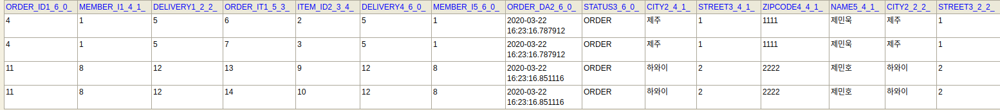

# 1. JPABook
> SpringBoot + JPA + thymeLeaf + H2 DB


<!-- TOC -->

- [1. JPABook](#1-jpabook)
  - [1.1. **[1] 설계 원칙**](#11-1-%ec%84%a4%ea%b3%84-%ec%9b%90%ec%b9%99)
    - [1.1.1. `Loosed Coupling & High Chesion`](#111-loosed-coupling--high-chesion)
    - [1.1.2. `역할에 따른 Domain Model`](#112-%ec%97%ad%ed%95%a0%ec%97%90-%eb%94%b0%eb%a5%b8-domain-model)
    - [1.1.3. `레이어별 Domain Model`](#113-%eb%a0%88%ec%9d%b4%ec%96%b4%eb%b3%84-domain-model)
  - [1.2. **[2] 개발과정**](#12-2-%ea%b0%9c%eb%b0%9c%ea%b3%bc%ec%a0%95)
    - [1.2.1. 세팅](#121-%ec%84%b8%ed%8c%85)
    - [1.2.2. Domain 개발](#122-domain-%ea%b0%9c%eb%b0%9c)
    - [1.2.3. Repository / Service 개발](#123-repository--service-%ea%b0%9c%eb%b0%9c)
    - [1.2.4. 웹 계층 개발](#124-%ec%9b%b9-%ea%b3%84%ec%b8%b5-%ea%b0%9c%eb%b0%9c)
  - [1.3. API 개발 및 성능 최적화](#13-api-%ea%b0%9c%eb%b0%9c-%eb%b0%8f-%ec%84%b1%eb%8a%a5-%ec%b5%9c%ec%a0%81%ed%99%94)
    - [1.3.1. postman 설치](#131-postman-%ec%84%a4%ec%b9%98)
    - [1.3.2. 회원 등록 API](#132-%ed%9a%8c%ec%9b%90-%eb%93%b1%eb%a1%9d-api)
      - [1.3.2.1. -1. V1](#1321--1-v1)
      - [1.3.2.2. -2. v2](#1322--2-v2)
    - [1.3.3. 회원 수정 API](#133-%ed%9a%8c%ec%9b%90-%ec%88%98%ec%a0%95-api)
    - [1.3.4. 회원 조회 API](#134-%ed%9a%8c%ec%9b%90-%ec%a1%b0%ed%9a%8c-api)
      - [1.3.4.1. V1](#1341-v1)
      - [1.3.4.2. V2](#1342-v2)
    - [1.3.5. 간단한 주문조회 (`OneToOne`, `ManyToOne` 조회)](#135-%ea%b0%84%eb%8b%a8%ed%95%9c-%ec%a3%bc%eb%ac%b8%ec%a1%b0%ed%9a%8c-onetoone-manytoone-%ec%a1%b0%ed%9a%8c)
      - [1.3.5.1. V1 Entity 반환](#1351-v1-entity-%eb%b0%98%ed%99%98)
      - [1.3.5.2. V2 DTO 반환](#1352-v2-dto-%eb%b0%98%ed%99%98)
      - [1.3.5.3. V3 DTO + fetch join 최적화 (엔티티 DTO 변환)](#1353-v3-dto--fetch-join-%ec%b5%9c%ec%a0%81%ed%99%94-%ec%97%94%ed%8b%b0%ed%8b%b0-dto-%eb%b3%80%ed%99%98)
      - [1.3.5.4. V4 JPA에서 DTO 바로 조회 (DTO 바로 조회)](#1354-v4-jpa%ec%97%90%ec%84%9c-dto-%eb%b0%94%eb%a1%9c-%ec%a1%b0%ed%9a%8c-dto-%eb%b0%94%eb%a1%9c-%ec%a1%b0%ed%9a%8c)
      - [1.3.5.5. V3 vs V4 (엔티티 조회 후 DTO 변환 vs DTO 바로 조회)](#1355-v3-vs-v4-%ec%97%94%ed%8b%b0%ed%8b%b0-%ec%a1%b0%ed%9a%8c-%ed%9b%84-dto-%eb%b3%80%ed%99%98-vs-dto-%eb%b0%94%eb%a1%9c-%ec%a1%b0%ed%9a%8c)
    - [1.3.6. 복잡한 주문조회 (`OneToMany`조회)](#136-%eb%b3%b5%ec%9e%a1%ed%95%9c-%ec%a3%bc%eb%ac%b8%ec%a1%b0%ed%9a%8c-onetomany%ec%a1%b0%ed%9a%8c)
      - [1.3.6.1. V1: 엔티티 직접 노출](#1361-v1-%ec%97%94%ed%8b%b0%ed%8b%b0-%ec%a7%81%ec%a0%91-%eb%85%b8%ec%b6%9c)
      - [1.3.6.2. V2: 엔티티를 DTO로 변환](#1362-v2-%ec%97%94%ed%8b%b0%ed%8b%b0%eb%a5%bc-dto%eb%a1%9c-%eb%b3%80%ed%99%98)
      - [1.3.6.3. V3: 엔티티를 DTO로 변환 (fetch join 최적화)](#1363-v3-%ec%97%94%ed%8b%b0%ed%8b%b0%eb%a5%bc-dto%eb%a1%9c-%eb%b3%80%ed%99%98-fetch-join-%ec%b5%9c%ec%a0%81%ed%99%94)
      - [1.3.6.4. V3.1: 엔티티를 DTO로 변환 - 페이징 한계 처리](#1364-v31-%ec%97%94%ed%8b%b0%ed%8b%b0%eb%a5%bc-dto%eb%a1%9c-%eb%b3%80%ed%99%98---%ed%8e%98%ec%9d%b4%ec%a7%95-%ed%95%9c%ea%b3%84-%ec%b2%98%eb%a6%ac)
      - [1.3.6.5. V4: JPA에서 DTO 직접 조회](#1365-v4-jpa%ec%97%90%ec%84%9c-dto-%ec%a7%81%ec%a0%91-%ec%a1%b0%ed%9a%8c)
      - [1.3.6.6. V5: JPA에서 DTO 직접 조회 - 컬렉션 조회 최적화](#1366-v5-jpa%ec%97%90%ec%84%9c-dto-%ec%a7%81%ec%a0%91-%ec%a1%b0%ed%9a%8c---%ec%bb%ac%eb%a0%89%ec%85%98-%ec%a1%b0%ed%9a%8c-%ec%b5%9c%ec%a0%81%ed%99%94)
      - [1.3.6.7. V6: JPA에서 DTO로 직접 조회, Flat Data 최적화](#1367-v6-jpa%ec%97%90%ec%84%9c-dto%eb%a1%9c-%ec%a7%81%ec%a0%91-%ec%a1%b0%ed%9a%8c-flat-data-%ec%b5%9c%ec%a0%81%ed%99%94)
  - [1.4. **[3] 조회 최적화 정리**](#14-3-%ec%a1%b0%ed%9a%8c-%ec%b5%9c%ec%a0%81%ed%99%94-%ec%a0%95%eb%a6%ac)
    - [1.4.1. -1. API 조회](#141--1-api-%ec%a1%b0%ed%9a%8c)
    - [1.4.2. -2. `조회 최적화 Best Practice`](#142--2-%ec%a1%b0%ed%9a%8c-%ec%b5%9c%ec%a0%81%ed%99%94-best-practice)
    - [1.4.3. -3. DTO 조회(v4,v5,v6) `Trade-Off`](#143--3-dto-%ec%a1%b0%ed%9a%8cv4v5v6-trade-off)
  - [1.5. **[4] OSIV**](#15-4-osiv)
    - [1.5.1. 해결책: **커멘드와 쿼리 분리**](#151-%ed%95%b4%ea%b2%b0%ec%b1%85-%ec%bb%a4%eb%a9%98%eb%93%9c%ec%99%80-%ec%bf%bc%eb%a6%ac-%eb%b6%84%eb%a6%ac)
  - [1.6. **[5] 추가적으로 공부할 거리**](#16-5-%ec%b6%94%ea%b0%80%ec%a0%81%ec%9c%bc%eb%a1%9c-%ea%b3%b5%eb%b6%80%ed%95%a0-%ea%b1%b0%eb%a6%ac)

<!-- /TOC -->

## 1.1. **[1] 설계 원칙**
### 1.1.1. `Loosed Coupling & High Chesion`
1. 모듈간의 연관관계가 interface로 느슨하게 연결되어야 한다.
2. 어떤 목적을 위해 연관된 기능들이 모여서 구현되고 지나치게 많은 일을 하지 않는다.

이를 구현하기 위해 DDD(Domain Driven Design)의 몇가지 원칙을 적용하겠다.

### 1.1.2. `역할에 따른 Domain Model`
- Domain(Entity, VO)
    - Entity
        - JPA의 @Table과 매핑
        - Business Logic은 `Service`가 아닌, 상태값을 지닌 Entity가 구현하도록 한다. (`OOP에서의 객체는 상태와 행위를 가진다.`)
    - VO는 (Entity)Status와 같이 부가정보, 상태, 등급같은 Class, Enum을 활용
- Aggregate
    - CASCADE mapping을 활용하여 Aggregate 생명주기 관리한다.
    - 복잡한 Aggregate는 쪼개서 로딩 효율을 높이는 것 대신 JPA Lazy loading을 사용해 필요한 시점에 필요한 데이터들만 로딩되도록 하여 개발 효율성과 속도적인 우의를 가진다.
        - **`1+n query problem` 문제는 Fetch join과 JPA가 DTO를 바로 조회하게 해주어(select에서 검색하는 요소 최적화) 성능최적화를 시켜준다.**
- Service
    - 트랜잭션 처리
    - 도메인 간의 연산 처리
    - Repository들을 field로 둔다.
    - thin layer
- Repository
    - JPA를 직접 사용하는 계층
    - Domain 모델 저장
    - EntityManager를 field로 두어, Entity, Aggregate Life Cycle을 관리
    - `JpaRepository interface`를 상속한다면 Factory를 활용해 객체 생성
- Factory
    - Entity, Aggregate 생성

- c.f) DAO/DTO 개념은 `TRANSACTION SCRIPT 패턴` 개념에서 사용하는 용어로 `DDD`개념과는 다른 개념 용어이다.

### 1.1.3. `레이어별 Domain Model`
1. 우선 Context로 분리
2. 이후 Context안에 존재하는 Layer별 분리한다.
3. user_interface -> application -> domain -> infrastructure 순서로 layer가 나뉘며, 상위 레이어는 하위 레이어를 의존한다. (user interface는 모든 하위 레이어를 의존 가능하며, 반대로 infrastructure는 다른 레이어를 의존하면 안된다.)

- Layer 종류
    - interface
        - 역할 : User interface ( 사용자 요청을 하위 layer에 전달 )
        - @Controller
        - @Component
            - 응답 객체 Cache Service
    - application
        - @Service
            - 복잡한 비즈니스 로직
            - Domain 조합 
    - domain
        - JPA의 Entity (비즈니스 로직)
        - Factory
    - infrastructure
        - 외부 통신하는 @Component
        - 영속성 구현 Dao

## 1.2. **[2] 개발과정**

### 1.2.1. 세팅

1. 프로젝트 생성
    - start.spring.io


    - dependency 설정
2. `Lombok`, `thyme-leaf` 실행 확인
    - `IntelliJ Lombok cannot find symbol 컴파일 에러`
        - [해결법](http://blog.devenjoy.com/?p=383)
        -  `IntelliJ Preferences => Build, Excution, Deployment => Compiler => Annotation Processors-> Enable annotation processing 체크` 
    

3. `h2`
    - 안정화 버전 1.4.199 설치
        - `ddl-auto : create`시, 테이블 Drop할때 에러가 뜨기 떄문에, 안정화된 버전을 사용한다.
    - `chmod 755 h2.sh`
        - ubuntu 실행 권한 부여
    - embedded로 `.mv`파일 먼저 생성후, spring 돌릴때는 tcp 통신
4. `application.yml`
    - `.properties`삭제

5. `JPA & DB` 실행 확인
    - Entity 생성
        - `Member`
            - `org.springframework.data.annotation.Id`는 non-relational DB
            - `javax.persistence.Id`는 relational data
    - Repository 생성
        - EntityManager `@PersistenceContext`
    - test
        - JAVA object가 JPA를 통해 EntityManager를 거쳐 생성해준 Repository를 거쳐 Getter를 통해 Id를 return한 값과, 제일 처음 시도했던 java object의 getID값과의 차이가 있는지 여부를 확인하는 테스트

### 1.2.2. Domain 개발
> Entity Constructor는 Protected with Lombok Annotation
- 도메인 모델과 테이블 설계
    - 
- 회원 엔티티 분석
    - 
- 회원 테이블 분석
    - 
1. Member Entity 생성
    - 회원
2. Order ENtity 생성
    - 주문
    - OrderStatus VO 생성
3. OrderItem Entity생성
    - 상품과 주문서의 관계를 가진 Entity
4. Item Entity 생성
    - Child Entity 생성
        - Album 
        - Book
        - Movie
5. Delivery Entity 생성
    - DeliveryStatus VO 생성
6. Address VO생성
    - `@Embeddable`, `Enum`

**컬렉션은 필드에서 초기화 하자.**

### 1.2.3. Repository / Service 개발
- 애플리케이션 아키텍처
    - 
1. MemberRepository 생성
    - @Repository: SQL_Exception 투명하게 에러 핸들링 가능
    - @PersistenceContext
        - JPA로부터 EntityManager를 DI받을 수 있다. (어떤 DB 의존성가질 것인가 등의 정보를 자동으로 처리, 생명주기)
        - Repository는 EntityManager를 Autowired시켜준다 (@PersistenceContext)
    - em.createQuery는 javax.persistence.Query (JPQL)

    - 참고로 Repository의 EntityManager도 주입 가능
    ```java
    @PersistenceContext //JPA로부터 EntityManager를DI받을 수 있다. (어떤 DB 의존성가질 것인가 등의 정보를자동으로 처리, 생명주기)
    private EntityManager em;
    ```
    ```java
    @Repository
    @RequiredArgsConstructor
    public class MemberRepository {
        private final EntityManager em;
        ...
    }
    ```
2. MemberService 생성
    - Entity값 Validation Code ( `validateDuplicateMember()` )
    - Repository에 CRUD 요청위임 method()들
        - SRP (Single Resposibility Principle) 하나의 class는 하나의 역할만 한다.
            - **Service는 다양한 Repository들을 모아서 logic들을 처리해주어야 한다. 그러므로 여러 Repository에게 위임한다.**
    - `@Transactional` 처리
        - readOnly를 통해서 최적화 시켜주고 Write가 필요한 작업만 Transactional 붙여준다.
    - 서비스는 트랜잭션의 단위이다.

3. MemberServiceTest()
- 테스트
    - 회원가입
        - 문제가 `@NoArgsConstructor(access = AccessLevel.PROTECTED)`로 `Member`를 보호해주었는데, test하기 위해서는 풀어주어야 하나? @Builder를 사용하면 되지 않을까? 
        - Member Entity 근본부터 잘못되었다. 근본은 Entity의 Setter는 닫아두고 Builder Pattern을 사용해서 생성자를 만들어준다. (ID를 제외한)
        - 이후 DTO를 사용하여 UPDATE와 관련된 Method들을 처리해준다.  -> 아니면 setter 열어두고 repository를 통해서 WAS단에서 수정된 데이터들을 proxy객체를 통해서 수정해준다.
        - **절대로 테이블과 매핑되는 Entity 클래스를 Request / Response 클래스로 사용해선 안됨.**
        - update 코드에 대한 Stack Overflow 글
            - ```java
                Customer customerToUpdate = customerRepository.getOne(id);
                customerToUpdate.setName(customerDto.getName);
                customerRepository.save(customerToUpdate);
               ```
                - SQL상에서도 Update Query만 생성된다.
    
        - `Caused by: org.hibernate.AnnotationException: Illegal attempt to map a non collection as a @OneToMany, @ManyToMany or @CollectionOfElements: jpabook.jpashop.domain.Category.parent` 에러 발생
            - `@ManyToOne(fetch = FetchType.LAZY)`로 Parent를 바꿔주었다.
        - ` Invocation of init method failed; nested exception is org.hibernate.AnnotationException: No identifier specified for entity: jpabook.jpashop.domain.item.Movie`
            - `public class Movie extends Item` extend를 빼먹었었다.

        - `java.lang.Exception: Test class should have exactly one public zero-argument constructor`, 테스트 환경에서는 `@RequiredArgsConstructor`를 통한 injection이 통하지 않는다. 즉 @Autowired 써주어야 한다.
    
    - 중복회원 예외
    
    - @TODO: **Entity에서 @Setter를 없애줄 수 있는 방법은 무엇일까?**
        - builder pattern

4. Item Entity
- Business Logic ( add , remove )
- Exception 생성
    - `NotEnoughStockException`

5. Item Repository
- Save()
    - persist()
    - @TODO: update용 코드를 위한 `.merge()`는 사용하지 않는다, 추후 준영속성 엔티티는 영속성을 부여해주어 처리한다.
- findOne()
- findAll()

6. Item Service
- Service는 SRP 원칙에 의해 Repository에게 위임한다. Service의 기능은 Transactional과 validate이고 validate 코드는 Entity에게 위임한다.

- Save()
    - 트랜잭션 처리
- findOne()
- findAll()


7. Order Entity
- 비즈니스 로직
    - 주문 취소
        - Order가 가진 주문 상태가 배송이 아니라면, 모든 OrderItem들을 Cancel 시켜준다.
        - `orderItem.cancel();` -> `deligate`
- 복잡한 생성 로직
    - setter는 내부에서만 사용하게 하기 위해 생성 메서드를 둔다.
    - 좋은 방법은 아니지만, BaseBean을 상속받는 것보다 비즈니스 로직 먼저 생성하는 것이 옳다고 생각한다.
- 조회 로직
    - **`int totalPrice` 필드를 두고 add, cancel 때마다 상태를 변경해준다.**
    - 주문을 한다면 : item의 잔고는 줄여주고, Order의 가격은 늘려주고
    - 주문을 취소한다면: item 잔고는 늘려주고, Order의 가격은 줄여주고

8. OrderItem Entity
- 주문취소
    - 취소될 때 Order에게 update되어야할 가격을 전달해준다.
- 복잡한 생성자


9. OrdeRepository
- Order의 persist를 deligate 시키는 클래스

10. OrderService
- 모든 Entity 조회는 service를 통해서 진행한다.
- 단 해당 엔티티의 Repository만 Repo를 통해서 접근한다.
- 기능
    - 주문
        - @TODO: **Delivery Entity를 Protected로 생성하니 Service단에서 생성하지 못한다. 평소에는 DTO를 통해서 생성하는 것이 옳은가?** -> 우선은 protected 열어주었다.

        - 필요 엔티티조회 -> 배송정보 생성 -> 주문 상품 생성 -> 주문 생성 -> 주문 저장 (Order에 연관관계 mapping Cascade를 진행해주었다.)
            - 이로 인하여 Order, Delivery, Address들이 Entity로 관리된다.

11. OrderServiceTest
- `Caused by: org.hibernate.service.spi.ServiceException: Unable to create requested service [org.hibernate.engine.jdbc.env.spi.JdbcEnvironment]`
    - h2 키니까 동작한다, 그런데 test는 인메모리 DB아닌가?
    - in-memory여도 termianl에서 ` jdbc:h2:mem:testdb`로 켜주어야 한다. h2 데이터 베이스를

- `java.lang.NullPointerException`
    - toatal Price 관련해서 dependency들을 넣어주니, Entity 생성에서 꼬인 것 같다.
    - ItemService에서 Repository에 final을 빼먹었다.
- Item에서 removeStockQuantity에서 예외처리 이후 update 코드를 빼먹었었다.

12. findAllByCriteria(OrderSearch orderSearch) & OrderSearch
- Getter / Setter를 가진 OrderSearch DTO를 생성해주고, 여기에 동적 쿼리에 담길 특성값들을 Set해준다. 이후 Criteria에 값을 넣어주어 Search해준다.


### 1.2.4. 웹 계층 개발
1. home controller 생성

2. segment html
- `.yml`에 파일명 컨벤션과 root path 설정
```yml
  thymeleaf:
    prefix: classpath:/templates/
    suffix: .html
```
- `header`
- `bodyheader`
- `footer`
3. css 생성
- bootstrap CDN
- jumbotron 수정 CSS 추가


4. MemberForm 생성
- Form이 하는 역할이 DTO 개념이 구현된 것일까?
- `@NotEmpty(message = "회원 이름은 필수입니다")`


5. MemberController
- `import org.springframework.ui.Model;`
    - attribute를 추가해서 View에 전달해주는 인터페이스
    - Dict 형식(java에서는 Map)형식으로 전달되는 듯하다?
- `import javax.validation.Valid;`

- `import org.springframework.validation.BindingResult;`
    - thyme-leaf는 MemberForm의 @Setter를 찾아서 연결해준다.
```java
    public String create(@Valid MemberForm form, BindingResult result) {

        if (result.hasErrors()) {
            return "members/createMemberForm";  //@TODO: 사용자 form 잘못 입력 페이지
        }
```
- Model에 앞서 `.addAttribute()`해주었기 때문에 MemberForm이 들어있다. (thyme-leaf를 통해서 setter가 발동했다 이미)
- 그런 상황에서 `BindingResult`는 `@Valid`지정한 객체를 `.hasErrors()`검사해주는데 form 객체에는 `@NotEmpty`제약 조건이 존재해서 검사 체크가 된다. 그런다음 return 해서 `Get Method`를 다시 쏴주면 저장한 데이터가 그대로 Entity에 들어있다. **(@TODO: 이렇게 정보를 저장하는 방법과 Session을 사용하는 방법과 무엇이 다를까?)**

6. template/members/createMemberForm.html
- `.fieldError` css style 추가

7. (c.f) `Form 객체` vs `Entity 객체`
- 요구사항이 정말 단순할 때는 Form 객체없이 엔티티를 직접 등록과 수정화면에서 사용해도 된다.
- 그러나 화면 요구사항이 복잡해지기 시작하면, 엔티티에 화면을 처리하기 위한 기능이 점점 증가하게 되어 결과적으로 **엔티티는 화면에 종속적으로 변하고 이에 따라 화면 기능 때문에 지저분해진 엔티티는 유지보수하기 어려워진다.**
- **실무에서 엔티티는 핵심 비즈니스 로직만 가지고, 화면을 위한 로직은 없어야 한다.**
- **화면이나 API에 맞는 폼객체나 DTO를 사용하자**
- 이를 통해 화면이나 API 요구사항을 Form, DTO로 처리하고 엔티티는 순수하게 유지한다.

8. Member List() 생성
- 회원 리스트를 보여주는 controller 생성
- `memberList.html` 생성
    - `<tr th:each="member : ${members}">`
        - `thyme-leaf`의 for each 문 
    - `<td th:text="${member.address?.city}"></td>`
    - `<td th:text="${member.address?.street}"></td>`
    - `<td th:text="${member.address?.zipcode}"></td>`
        - 타임리프에서 `?`를 사용하면 null은 무시해서 렌더링 해준다. 매우 편리한 기능

9. BookForm (상품 form) 클래스 생성
- @TODO: `ID`를 폼에서 처리할 때는 오류 체크 안해줘도 될까??

10. ItemController
- `createForm`
    - form 객체를 넘겨줌
- `create`
    - validate 검증 -> service로 위임
    - 1차적인 에러 검증, positive, @NOtEmpty
    - 1차적인 검증이 완료된다면, book 객체를 생성한다. 이때 id값은 자동으로 처리된다.
    - **id 필드가 자동으로 생성된다면 form객체에 id 필드를 생성해줄 필요가있을까??**
        - `<tr th:each="item : ${items}"><td th:text="${item.id}"></td>` 처럼 view 코드에서 item에 접근하기 위해서는 id 값을 저장하고 있어야 한다. 그런데 itemForm에서 id값이 필요한게 아니라 item 엔티티에서 필요한 것이니 왠지 form 객체에서 item 필드를 Member처럼 없애도 될 것 같다.
- `items/createItemForm.html`
    - @TODO: item에 대해서 @Positive 같은 validation 에러가 먹히지 않는다. (thyme leaf 문제)

- `items/createItemForm.html`
    - 계속 `org.thymeleaf.exceptions.TemplateInputException: Error resolving template [items/itemList], template might not exist or might not be accessible by any of the configured Template Resolvers` 에러 발생
        - 모든 시도를 해본 결과 `/items/items/itemList.html`로 디렉토리가 잡혀있었다.

11. ItemController (update item) 
- Service 코드 update 추가
- updateItem.html 생성
- updateForm(), update() 함수 생성
- update코드 service에서 구현
    -
    ```java
        //update 된다면 dirty checking이 일어나서 update query가 쏴진다. 수정 코드는 service에서 위임받아서 해준다 절대 controller에서 해주지 말자 (controller는 DTO만 쏴준다)
        @Transactional  
        public void updateItem(Long id, String name, int price) {
            Item item = itemRepository.findOne(id);
            item.setName(name);
            item.setPrice(price);
        }
    ```

- [영속성 life Cycle](https://joont92.github.io/jpa/%EC%9B%B9-%EC%96%B4%ED%94%8C%EB%A6%AC%EC%BC%80%EC%9D%B4%EC%85%98%EA%B3%BC-%EC%98%81%EC%86%8D%EC%84%B1-%EA%B4%80%EB%A6%AC/)
    - @TODO:
    - 스프링 트랜잭션 AOP는 `@Transactional`어노테이션이 붙은 메서드가 호출될 때 트랜잭션을 시작한다.
    - 트랜잭션이 같으면 같은 영속성 컨텍스트를 사용하지만, 다른 경우 다른 영속성 컨텍스트를 사용한다.
    - 트랜잭션과 영속성 컨텍스트의 생명주기가 같으므로 트랜잭션이 끝남과 동시에 영속성 컨텍스트도 종료된다.
        - em.close()가 이뤄지기 때문에 해당 영속성 컨텍스트에 존재하던 1차 캐시 엔티티들을 detach상태로 변경한다.
    - `controller`에서 service를 통하여 1차 캐시에 존재하는 엔티티를 find했을때, detached 된 엔티티가 호출된다.
    - **만약 @Transactional 메서드에서 다른 2개의 repository를 호출하여 EntityManager를 injection 받았다면, 두 repository의 EntityManager(영속성 컨텍스트)는 같다. 하지만 같은 Repository를 사용하더라도 다른 @Transactional을 사용한다면 둘의 영속성 컨텍스트는 다르게 된다.**
    - 반대로 준영속성 컨텍스트가 영속성을 획득하는 경우
        - `준영속성 -- transactional 시작, 영속성컨텍스트 생성 -- > 영속성 획득, 엔티티 수정 --- dirty checking --> update Query ---> 영속성 컨텍스트 종료, 트랜잭션 종료`


12. OrderController
- cancel
- findOrders
- update Order

## 1.3. API 개발 및 성능 최적화

### 1.3.1. postman 설치

### 1.3.2. 회원 등록 API
- `@RestController`를 사용하여 method에게 `@ResponseBody`붙여주지 않아도 알아서 전달할 type 결정해주게 한다.
#### 1.3.2.1. -1. V1
1. `CreateMemberResponse` 생성
2. /dto/ 생성
    - `CreateMemberRequest`
    - `CreateMemberResponse`

3. 문제점
    - Entity에 Presentation 계층을 위한 로직 추가
    - Entity에 API 검증을 위한 로직 추가 ( @NotEmpty )
    - 하나의 엔티티에 다양한 API가 필요한데, Entity를 넘겨주면 추후의 복잡한 API들을 추가해주기 어렵다.
    - **`Entity`가 변경되면 `API스펙`이 변한다.**
4. 해결책: API 요청 스펙에 맞추어 별도의 DTO를 파라미터로 받는다.
    - 디렉토리 구조를 어떻게 해야할까?

#### 1.3.2.2. -2. v2
- `CreateMemberRequest`를 `Member` 대신에 `@RequestBody`와 매핑한다.
- **엔티티와 프레젠테이션 계층을 위한 로직을 분리한다.**
    - **엔티티를 API스펙에 노출하면 절대 안된다.**
- 엔티티가 변해도 API 스펙이 변하지 않는다.
```
    Resolved [org.springframework.http.converter.HttpMessageNotReadableException: JSON parse error: Cannot construct instance of `jpabook.jpashop.dto.CreateMemberRequest` (although at least one Creator exists): cannot deserialize from Object value (no delegate- or property-based Creator); nested exception is com.fasterxml.jackson.databind.exc.MismatchedInputException: Cannot construct instance of `jpabook.jpashop.dto.CreateMemberRequest` (although at least one Creator exists): cannot deserialize from Object value (no delegate- or property-based Creator)
    at [Source: (PushbackInputStream); line: 2, column: 2]]
```
- **RequestBody 생성자를 찾지 못한 문제**
    - 원인 분석결과 Request DTO에 @AllArgsConstructor가 존재하여 디폴트 생성자가 만들어지지 않았다.
    - @Data는 @RequiredArgsConstructor를 포함시켜주는데, 이는 final에 대해서만 생성자를 만들어준다. 그런데 RequestDTO에서는 final field가 없었기 때문에 디폴트 생성자가 존재 가능하였다.
    - @AllArgsConstructor를 사용하고 싶다면 @NoArgsConstructor와 같이 사용해야 생성을 못하는 일을 막을 수 있다.
- `Response 객체도 디폴트 생성자 없는데 왜 에러가 터지지 않았나?`
    - `@RequestBody`를 받은 Request 클래스는 `org.springframework.http.converter`를 통하여 자동으로 `new`가 생성되는데, 이에반하여 `Response`클래스는 소스코드에서 `new`를 직접 호출하여 return한다. 
    - 문제가 생겼던것은 생성자를 spring이 찾지 못하여 생겼던 것이기 때문에, Response는 해당 문제에서 자유로울 수 있다.
- @TODO:그렇다면 왜 Spring은 디폴트 생성자가 필요할까?

### 1.3.3. 회원 수정 API
- `updateMemberV2()`
    - service layer에 `@Transactional update()` 생성
- update req,rep DTO 생성
    - `UpdateMemberRequest`
        - @TODO: request는 static으로 생성이유 ( spring이 찾아야 하니까?)
    - `UpdateMemberResponse`

### 1.3.4. 회원 조회 API
#### 1.3.4.1. V1
> 응답 값으로 엔티티를 직접 외부에 노출

- `membersV1()` 생성
    - MemberService의 `findAll()` return

- 문제점
    1. 앞서 언급한 Entity를 전달할때의 문제점
    2. `Collection`을 반환하면 배열로 전달되어서 JSON을 유연하게 사용하기 어렵다.
        - `[ ]`타입으로 api 스펙이 정의된다면, count와 같은 값을 추가하기 
    3. `Infinite recursion`
        - `org.springframework.http.converter.HttpMessageNotWritableException: Could not write JSON: Infinite recursion (StackOverflowError); nested exception is com.fasterxml.jackson.databind.JsonMappingException: Infinite recursion (StackOverflowError) (through reference chain: jpabook.jpashop.domain.Order["member"]->jpabook.jpashop.domain.Member["orders"]->org.hibernate.collection.internal.PersistentBag[0]->jpabook.jpashop.domain.Order["member"]->jpabook.jpashop.domain.Member["orders"]->org.hibernate.collection.internal.PersistentBag[0]->jpabook.jpashop.domain.Order["member"]->jpabook.jpashop.domain.Member["orders"]`
        - Member 가 Order가 `양방향 mapping` 되었다면 Converter가 JSON화 시켜줄때 무한히 끌어서 전달한다.
        - 무식한 해결방법(json ignore)
            - @JsonManagedReference
                - 참조가 되는 앞부분을 의미하며, 정상적으로 직렬화를 수행한다.
                - Collection Type 에 적용된다.
            - @JsonBackReference
                - 참조가 되는 뒷부분을 의미하며, 직렬화를 수행하지 않는다.


#### 1.3.4.2. V2
1. V1 해결방안
    - DTO
        - MemberDTO
            - DTO로 감싸야한다는 것은, 모든 전달되는 Entity들에 대해서 해당된다. (2중구조로 감싸지더라도 DTO로 감싼다)
        - MemberListResponse
            - MemberDTO로 감싸진 Member를 Collection 타입으로 주는 것이 아닌, 한번더 DTO로 감싸서 JSON의 유연성을 확보한다.
    - @TODO: 이렇게 하면 recursion에 걸리지 않는 이유는? DTO로 문제가 되는 Order를 가져오지 않아서
    - DTO를 사용하면 좋은 추가적인 이유로 **해당 Entity의 원하는 field값만 return 할 수있다.**

### 1.3.5. 간단한 주문조회 (`OneToOne`, `ManyToOne` 조회)
> orderItem을 제외하고 Order 목록만 보여준다. 최종적으로 O(1) query가능
- toOne(OneToOne, ManyToOne)관계만 존재
- 원하는 Data
```json
{
    "data": [
        {
            "orderId": 4,
            "name": "제민욱",
            "orderDate": "2020-03-22T15:05:58.312896",
            "orderStatus": "ORDER",
            "address": {
                "city": "제주",
                "street": "1",
                "zipcode": "1111"
            }
        },
        {
            "orderId": 11,
            "name": "제민호",
            "orderDate": "2020-03-22T15:05:58.389921",
            "orderStatus": "ORDER",
            "address": {
                "city": "하와이",
                "street": "2",
                "zipcode": "2222"
            }
        }
    ]
}
```

#### 1.3.5.1. V1 Entity 반환
- `ordersV1()` 생성
    - order -> member 와 order ->address LAZY Loading( Proxy 객체 ) -> Jackson이 프록시 객체를 json으로 생성하는 방법을 모른다. (Hibernate5Module을 스프링 빈으로 등록 하여 해결)

- `com.fasterxml.jackson.datatype:jackson-datatype-hibernate5` 라이브러리 추가
- `FORCE_LAZY_LOADING` on

```java
    @Bean
    Hibernate5Module hibernate5Module() {
        Hibernate5Module hibernate5Module = new Hibernate5Module();
        hibernate5Module.configure(Hibernate5Module.Feature.FORCE_LAZY_LOADING,
                true);
        return hibernate5Module;
    }
```
- 기본적으로 Hibernate는 초기화 된 프록시 객체만 노출한다. 초기화 되지 않은 프록시 객체는 노출하지 않는다.
- `양방향 연관관계` 무한 로딩 방지
    - @JsonIgnore

#### 1.3.5.2. V2 DTO 반환
- `ordersV2()` 생성
    - `Order` -> `SimpleOrderDto`

- 문제점
    - `1+N+N` 쿼리
        - order 1
        - member N
        - delivery N
    - 다행히 Lazy_loading은 영속성 컨텍스트에서 조회하기 때문에 1차 캐시에 존재하는 경우 쿼리는 생략된다.
        - @TODO: 영속성 컨텍스트와 1차캐시와의 관계

- Order 조회
```sql
    select
        order0_.order_id as order_id1_6_,
        order0_.delivery_id as delivery4_6_,
        order0_.member_id as member_i5_6_,
        order0_.order_date as order_da2_6_,
        order0_.status as status3_6_ 
    from
        orders order0_
```
- Member 조회
```sql
    select 
        member0_.member_id as member_i1_4_0_, 
        member0_.city as city2_4_0_, 
        member0_.street as street3_4_0_, 
        member0_.zipcode as zipcode4_4_0_, 
        member0_.name as name5_4_0_ 
    from 
        member member0_ 
    where 
        member0_.member_id=1;
```
```sql
    select
        member0_.member_id as member_i1_4_0_,
        member0_.city as city2_4_0_,
        member0_.street as street3_4_0_,
        member0_.zipcode as zipcode4_4_0_,
        member0_.name as name5_4_0_ 
    from
        member member0_ 
    where
        member0_.member_id=8;
```

- Delivery 조회
```sql
    select
        delivery0_.delivery_id as delivery1_2_0_,
        delivery0_.city as city2_2_0_,
        delivery0_.street as street3_2_0_,
        delivery0_.zipcode as zipcode4_2_0_,
        delivery0_.status as status5_2_0_ 
    from
        delivery delivery0_ 
    where
        delivery0_.delivery_id=5
```

```sql
    select
        delivery0_.delivery_id as delivery1_2_0_,
        delivery0_.city as city2_2_0_,
        delivery0_.street as street3_2_0_,
        delivery0_.zipcode as zipcode4_2_0_,
        delivery0_.status as status5_2_0_ 
    from
        delivery delivery0_ 
    where
        delivery0_.delivery_id=12
```


#### 1.3.5.3. V3 DTO + fetch join 최적화 (엔티티 DTO 변환)

- 엔티티 fetch join으로 쿼리 1번에 조회
- 지연 로딩 x (페치 조인으로 member,delivery는 이미 참조)

```sql
    select
        order0_.order_id as order_id1_6_0_,
        member1_.member_id as member_i1_4_1_,
        delivery2_.delivery_id as delivery1_2_2_,
        order0_.delivery_id as delivery4_6_0_,
        order0_.member_id as member_i5_6_0_,
        order0_.order_date as order_da2_6_0_,
        order0_.status as status3_6_0_,
        member1_.city as city2_4_1_,
        member1_.street as street3_4_1_,
        member1_.zipcode as zipcode4_4_1_,
        member1_.name as name5_4_1_,
        delivery2_.city as city2_2_2_,
        delivery2_.street as street3_2_2_,
        delivery2_.zipcode as zipcode4_2_2_,
        delivery2_.status as status5_2_2_ 
    from
        orders order0_ 
    inner join
        member member1_ 
            on order0_.member_id=member1_.member_id 
    inner join
        delivery delivery2_ 
            on order0_.delivery_id=delivery2_.delivery_id
```

- 만약 같은 Member가 다른 Order를 여러번 했다면, member query는 해당 영속성 컨텍스트 sql query 캐시에 존재하므로 1번만 검색할 것이다.

#### 1.3.5.4. V4 JPA에서 DTO 바로 조회 (DTO 바로 조회)
- 장점
    - select 절에서 원하는 데이터 직접 조회 (원하는 값 선택 조회)
    - 미비하긴 하지만, 애플리케이션 네트워크 용량 최적화
- 단점
    - repository 재사용성 떨어짐
    - **API 스펙에 맞춘 코드가 Repository에 들어가게된다.**
```sql
    select
        order0_.order_id as col_0_0_,
        member1_.name as col_1_0_,
        order0_.order_date as col_2_0_,
        order0_.status as col_3_0_,
        delivery2_.city as col_4_0_,
        delivery2_.street as col_4_1_,
        delivery2_.zipcode as col_4_2_ 
    from
        orders order0_ 
    inner join
        member member1_ 
            on order0_.member_id=member1_.member_id 
    inner join
        delivery delivery2_ 
            on order0_.delivery_id=delivery2_.delivery_id
```

#### 1.3.5.5. V3 vs V4 (엔티티 조회 후 DTO 변환 vs DTO 바로 조회)
- V3
    - 리포지토리 재사용성 증가
    - 개발 단순화
- V4
    - Select 원하는 값 선택 조회
    - 미비하지만 네트워크 최적화 (불필요한 select 돌아가지 않으니)    


### 1.3.6. 복잡한 주문조회 (`OneToMany`조회)
> Simple Order API + Order기준으로 Collection 검색 (`OrderItem`, `Item`)

- 원하는 Data
```json
{
    "data": [
        {
            "id": 4,
            "member": {
                "id": 1,
                "name": "제민욱",
                "address": {
                    "city": "제주",
                    "street": "1",
                    "zipcode": "1111"
                }
            },
            "orderItems": [
                {
                    "id": 6,
                    "item": {
                        "id": 2,
                        "name": "JPA1 BOOK",
                        "price": 10000,
                        "stockQuantity": 99,
                        "categories": [],
                        "author": null,
                        "isbn": null
                    },
                    "orderPrice": 10000,
                    "count": 1,
                    "totalPrice": 10000
                },
                {
                    "id": 7,
                    "item": {
                        "id": 3,
                        "name": "JPA2 BOOK",
                        "price": 20000,
                        "stockQuantity": 98,
                        "categories": [],
                        "author": null,
                        "isbn": null
                    },
                    "orderPrice": 10000,
                    "count": 2,
                    "totalPrice": 20000
                }
            ],
            "delivery": {
                "id": 5,
                "address": {
                    "city": "제주",
                    "street": "1",
                    "zipcode": "1111"
                },
                "status": null
            },
            "orderDate": "2020-03-22T15:48:48.867764",
            "status": "ORDER",
            "totalPrice": 30000
        },
        {
            "id": 11,
            "member": {
                "id": 8,
                "name": "제민호",
                "address": {
                    "city": "하와이",
                    "street": "2",
                    "zipcode": "2222"
                }
            },
            "orderItems": [
                {
                    "id": 13,
                    "item": {
                        "id": 9,
                        "name": "SPRING1 BOOK",
                        "price": 20000,
                        "stockQuantity": 197,
                        "categories": [],
                        "author": null,
                        "isbn": null
                    },
                    "orderPrice": 20000,
                    "count": 3,
                    "totalPrice": 60000
                },
                {
                    "id": 14,
                    "item": {
                        "id": 10,
                        "name": "SPRING2 BOOK",
                        "price": 40000,
                        "stockQuantity": 296,
                        "categories": [],
                        "author": null,
                        "isbn": null
                    },
                    "orderPrice": 40000,
                    "count": 4,
                    "totalPrice": 160000
                }
            ],
            "delivery": {
                "id": 12,
                "address": {
                    "city": "하와이",
                    "street": "2",
                    "zipcode": "2222"
                },
                "status": null
            },
            "orderDate": "2020-03-22T15:48:48.943277",
            "status": "ORDER",
            "totalPrice": 220000
        }
    ]
}
```

#### 1.3.6.1. V1: 엔티티 직접 노출


- Order field들 중, 양방향으로 order와 관계가지는 Entity들 `@JsonIgnore` 설정
    - `OrderItem`
    - `Member`
    - `Delivery`
- `List<Order> ordersV1()` 생성

```sql
    select
        order0_.order_id as order_id1_6_,
        order0_.delivery_id as delivery4_6_,
        order0_.member_id as member_i5_6_,
        order0_.order_date as order_da2_6_,
        order0_.status as status3_6_ 
    from
        orders order0_
```
```sql
    select
        member0_.member_id as member_i1_4_0_,
        member0_.city as city2_4_0_,
        member0_.street as street3_4_0_,
        member0_.zipcode as zipcode4_4_0_,
        member0_.name as name5_4_0_ 
    from
        member member0_ 
    where
        member0_.member_id=?
```
```sql
    select
        delivery0_.delivery_id as delivery1_2_0_,
        delivery0_.city as city2_2_0_,
        delivery0_.street as street3_2_0_,
        delivery0_.zipcode as zipcode4_2_0_,
        delivery0_.status as status5_2_0_ 
    from
        delivery delivery0_ 
    where
        delivery0_.delivery_id=?
```
```sql
    select
        orderitems0_.order_id as order_id5_5_0_,
        orderitems0_.order_item_id as order_it1_5_0_,
        orderitems0_.order_item_id as order_it1_5_1_,
        orderitems0_.count as count2_5_1_,
        orderitems0_.item_id as item_id4_5_1_,
        orderitems0_.order_id as order_id5_5_1_,
        orderitems0_.order_price as order_pr3_5_1_ 
    from
        order_item orderitems0_ 
    where
        orderitems0_.order_id=?
```
```sql
    select
        item0_.item_id as item_id2_3_0_,
        item0_.name as name3_3_0_,
        item0_.price as price4_3_0_,
        item0_.stock_quantity as stock_qu5_3_0_,
        item0_.author as author6_3_0_,
        item0_.isbn as isbn7_3_0_,
        item0_.actor as actor8_3_0_,
        item0_.director as director9_3_0_,
        item0_.artist as artist10_3_0_,
        item0_.etc as etc11_3_0_,
        item0_.dtype as dtype1_3_0_ 
    from
        item item0_ 
    where
        item0_.item_id=?
```
```sql
    select
        item0_.item_id as item_id2_3_0_,
        item0_.name as name3_3_0_,
        item0_.price as price4_3_0_,
        item0_.stock_quantity as stock_qu5_3_0_,
        item0_.author as author6_3_0_,
        item0_.isbn as isbn7_3_0_,
        item0_.actor as actor8_3_0_,
        item0_.director as director9_3_0_,
        item0_.artist as artist10_3_0_,
        item0_.etc as etc11_3_0_,
        item0_.dtype as dtype1_3_0_ 
    from
        item item0_ 
    where
        item0_.item_id=?
```
```sql
    select
        member0_.member_id as member_i1_4_0_,
        member0_.city as city2_4_0_,
        member0_.street as street3_4_0_,
        member0_.zipcode as zipcode4_4_0_,
        member0_.name as name5_4_0_ 
    from
        member member0_ 
    where
        member0_.member_id=?
```
```sql
    select
        delivery0_.delivery_id as delivery1_2_0_,
        delivery0_.city as city2_2_0_,
        delivery0_.street as street3_2_0_,
        delivery0_.zipcode as zipcode4_2_0_,
        delivery0_.status as status5_2_0_ 
    from
        delivery delivery0_ 
    where
        delivery0_.delivery_id=?
```
```sql
    select
        orderitems0_.order_id as order_id5_5_0_,
        orderitems0_.order_item_id as order_it1_5_0_,
        orderitems0_.order_item_id as order_it1_5_1_,
        orderitems0_.count as count2_5_1_,
        orderitems0_.item_id as item_id4_5_1_,
        orderitems0_.order_id as order_id5_5_1_,
        orderitems0_.order_price as order_pr3_5_1_ 
    from
        order_item orderitems0_ 
    where
        orderitems0_.order_id=?
```
```sql
    select
        item0_.item_id as item_id2_3_0_,
        item0_.name as name3_3_0_,
        item0_.price as price4_3_0_,
        item0_.stock_quantity as stock_qu5_3_0_,
        item0_.author as author6_3_0_,
        item0_.isbn as isbn7_3_0_,
        item0_.actor as actor8_3_0_,
        item0_.director as director9_3_0_,
        item0_.artist as artist10_3_0_,
        item0_.etc as etc11_3_0_,
        item0_.dtype as dtype1_3_0_ 
    from
        item item0_ 
    where
        item0_.item_id=?
```
```sql
    select
        item0_.item_id as item_id2_3_0_,
        item0_.name as name3_3_0_,
        item0_.price as price4_3_0_,
        item0_.stock_quantity as stock_qu5_3_0_,
        item0_.author as author6_3_0_,
        item0_.isbn as isbn7_3_0_,
        item0_.actor as actor8_3_0_,
        item0_.director as director9_3_0_,
        item0_.artist as artist10_3_0_,
        item0_.etc as etc11_3_0_,
        item0_.dtype as dtype1_3_0_ 
    from
        item item0_ 
    where
        item0_.item_id=?
```
```sql
    select
        categories0_.item_id as item_id2_1_0_,
        categories0_.category_id as category1_1_0_,
        category1_.category_id as category1_0_1_,
        category1_.name as name2_0_1_,
        category1_.parent_id as parent_i3_0_1_ 
    from
        category_item categories0_ 
    inner join
        category category1_ 
            on categories0_.category_id=category1_.category_id 
    where
        categories0_.item_id=?
```
```sql
    select
        categories0_.item_id as item_id2_1_0_,
        categories0_.category_id as category1_1_0_,
        category1_.category_id as category1_0_1_,
        category1_.name as name2_0_1_,
        category1_.parent_id as parent_i3_0_1_ 
    from
        category_item categories0_ 
    inner join
        category category1_ 
            on categories0_.category_id=category1_.category_id 
    where
        categories0_.item_id=?
```
```sql
    select
        categories0_.item_id as item_id2_1_0_,
        categories0_.category_id as category1_1_0_,
        category1_.category_id as category1_0_1_,
        category1_.name as name2_0_1_,
        category1_.parent_id as parent_i3_0_1_ 
    from
        category_item categories0_ 
    inner join
        category category1_ 
            on categories0_.category_id=category1_.category_id 
    where
        categories0_.item_id=?
```
```sql
    select
        categories0_.item_id as item_id2_1_0_,
        categories0_.category_id as category1_1_0_,
        category1_.category_id as category1_0_1_,
        category1_.name as name2_0_1_,
        category1_.parent_id as parent_i3_0_1_ 
    from
        category_item categories0_ 
    inner join
        category category1_ 
            on categories0_.category_id=category1_.category_id 
    where
        categories0_.item_id=?
```

- SQL 실행 수
    - order
        - 1번
    - member , address
        - N번(order 조회 수 만큼)
    - orderItem
        - N번(order 조회 수 만큼)
    - item
        - N번(orderItem 조회 수 만큼)

#### 1.3.6.2. V2: 엔티티를 DTO로 변환
- `OrderItemDto` 생성
- `OrderDto` 생성
- `OrderListResponse ordersV2()` 생성
    - `OrderApiController` 클래스 안에


#### 1.3.6.3. V3: 엔티티를 DTO로 변환 (fetch join 최적화)
- `orderV3()`
- Repository에 `findAllWithItem()` 추가
```java
    // 주문조회 V3
    public List<Order> findAllWithItem() {
        return em.createQuery(
                "select distinct o from Order o" +
                        " join fetch o.member m" +
                        " join fetch o.delivery d" +
                        " join fetch o.orderItems oi" +
                        " join fetch oi.item i", Order.class)
                .getResultList();
        
    }
```
- JPQL에서 `distinct`
    - SQL에 distinct를 추가
    - 같은 엔티티가 조회되면 애플리케이션에서 중복 걸러준다.

- 단점: **페이징이 불가능하다**
    - `limit`
    - `offset`
    - 정확하게는 컬렉션 페치 조인한 상태에서 페이징을 요구하면, 하이버네이트는 무엇을 기준으로 페이징을 해야하는지 모르기 때문에, 경고 로그를 남기면서 모든 데이터를 DB로 부터 읽어온뒤, **메모리에서 페이징 해버린다.**
    - 이때 생성된 페이징은 내가 원하던 Order 기준이 아닌, 더 많은 수를 차지하는 OrderItem(쿼리 뻥튀기 시킨 데이터)을 기준으로 페이징이 되기 때문에 부정확하다.

- **컬렉션 fetch join은 1개만 사용하라**
    - 컬렉션이 둘 이상 fetch join할 경우 데이터 `정합성`이 깨질 수 있다.

- query 1번으로 최적화
```sql
    select
        distinct order0_.order_id as order_id1_6_0_,
        member1_.member_id as member_i1_4_1_,
        delivery2_.delivery_id as delivery1_2_2_,
        orderitems3_.order_item_id as order_it1_5_3_,
        item4_.item_id as item_id2_3_4_,
        order0_.delivery_id as delivery4_6_0_,
        order0_.member_id as member_i5_6_0_,
        order0_.order_date as order_da2_6_0_,
        order0_.status as status3_6_0_,
        member1_.city as city2_4_1_,
        member1_.street as street3_4_1_,
        member1_.zipcode as zipcode4_4_1_,
        member1_.name as name5_4_1_,
        delivery2_.city as city2_2_2_,
        delivery2_.street as street3_2_2_,
        delivery2_.zipcode as zipcode4_2_2_,
        delivery2_.status as status5_2_2_,
        orderitems3_.count as count2_5_3_,
        orderitems3_.item_id as item_id4_5_3_,
        orderitems3_.order_id as order_id5_5_3_,
        orderitems3_.order_price as order_pr3_5_3_,
        orderitems3_.order_id as order_id5_5_0__,
        orderitems3_.order_item_id as order_it1_5_0__,
        item4_.name as name3_3_4_,
        item4_.price as price4_3_4_,
        item4_.stock_quantity as stock_qu5_3_4_,
        item4_.author as author6_3_4_,
        item4_.isbn as isbn7_3_4_,
        item4_.actor as actor8_3_4_,
        item4_.director as director9_3_4_,
        item4_.artist as artist10_3_4_,
        item4_.etc as etc11_3_4_,
        item4_.dtype as dtype1_3_4_ 
    from
        orders order0_ 
    inner join
        member member1_ 
            on order0_.member_id=member1_.member_id 
    inner join
        delivery delivery2_ 
            on order0_.delivery_id=delivery2_.delivery_id 
    inner join
        order_item orderitems3_ 
            on order0_.order_id=orderitems3_.order_id 
    inner join
        item item4_ 
            on orderitems3_.item_id=item4_.item_id
```
- Distinct
    - sql에서의 distinct는 모든 row가 같아야 중복제거 된다. 하지만 jpa에서 Entity가 같은 Entity라면 jpa상에서 중복 제거해준다.
    - 실제 sql상에서 table



#### 1.3.6.4. V3.1: 엔티티를 DTO로 변환 - 페이징 한계 처리
> 1+N+N -> 1+1+1

1. toOne 관계는 fetch join + offset,limit 전달
```java
    public List<Order> findAllWithMemberDeliver(int offset,int limit) {
        return em.createQuery(
                "select o from Order o" +
                        " join fetch o.member m" +
                        " join fetch o.delivery d", Order.class)
                .setFirstResult(offset)
                .setMaxResults(limit)
                .getResultList();
    }
```
2. `hibernate.default_batch_fetch_size` , `@BatchSize`: 개별 최적화
이 옵션을 사용하면 컬렉션이나, 프록시 객체를 한꺼번에 설정한 size 만큼 IN 쿼리로 조회한다. (**인쿼리 파라미터 갯수**)
```sql
select item0_.item_id as item_id2_3_0_, item0_.name as name3_3_0_, item0_.price as price4_3_0_, item0_.stock_quantity as stock_qu5_3_0_, item0_.author as author6_3_0_, item0_.isbn as isbn7_3_0_, item0_.actor as actor8_3_0_, item0_.director as director9_3_0_, item0_.artist as artist10_3_0_, item0_.etc as etc11_3_0_, item0_.dtype as dtype1_3_0_ from item item0_ where item0_.item_id in (2, 3, 9, 10, 16, 17, 23, 24, 30, 31, 37, 38, 44, 45, 51);

select item0_.item_id as item_id2_3_0_, item0_.name as name3_3_0_, item0_.price as price4_3_0_, item0_.stock_quantity as stock_qu5_3_0_, item0_.author as author6_3_0_, item0_.isbn as isbn7_3_0_, item0_.actor as actor8_3_0_, item0_.director as director9_3_0_, item0_.artist as artist10_3_0_, item0_.etc as etc11_3_0_, item0_.dtype as dtype1_3_0_ from item item0_ where item0_.item_id in (52, 58, 59, 65, 66);
```

-  @TODO: 인쿼리가 15개에서 잘리는 이유가 대체 뭘까?
    - 실제로 쿼리 log를 보면 in query가 15개를 max로 해서 db select를 돌린다. item의 갯수가 20개였는데, 15, 5개로 나눠서 query를 날렸다. 
    1) HikariCP의 default Connection pool은 10이라고 하는데
    2) log를 보여주는 ps6py에서 15개 단위로 잘라서 쿼리상으로 그렇게 보여지는 걸까? 실제로는 1번만 보내지는데 p6spy에서 잘라서 보여주는 경우
    3) 
```json
      "name": "decorator.datasource.flexy-pool.acquiring-strategy.increment-pool.max-overflow-pool-size",
      "type": "java.lang.Integer",
      "sourceType": "com.github.gavlyukovskiy.boot.jdbc.decorator.flexypool.FlexyPoolProperties$AcquiringStrategy$IncrementPool",
      "defaultValue": 15
```

#### 1.3.6.5. V4: JPA에서 DTO 직접 조회
- `ordersV4()`
- `OrderQueryRepository`
- `OrderQueryDto`
- `OrderItemQueryDto`
- @TODO: `fetch join vs join`

- `xToOne + xToMany` 관계 통합
```java
    public List<OrderQueryDto> findOrderQueryDtos() {
        // 루트 조회 ( toOne 코드 한번에 조회 )
        List<OrderQueryDto> result = findOrders();

        // 컬렉션 추가
        result.forEach(o -> {
            List<OrderItemQueryDto> orderItems = findOrderItems(o.getOrderId());
            o.setOrderItems(orderItems);
        });

        return result;
    }
```
- `xToOne`, `xToMany` 쿼리
```java
   /**
     * xToOne 관계 조회
     */
    private List<OrderQueryDto> findOrders() {
        return em.createQuery("select new jpabook.jpashop.dto.OrderQueryDto(o.id, m.name, o.orderDate, o.status, d.address)" +
                " from Order o" +
                " join o.member m" +
                " join o.delivery d", OrderQueryDto.class)
                .getResultList();
    }

    /**
     * xToMany 관계 조회
     */
    private List<OrderItemQueryDto> findOrderItems(Long orderId) {
        return em.createQuery("select new jpabook.jpashop.dto.OrderItemQueryDto(oi.order.id, i.name, oi.orderPrice, oi.count)" +
                        " from OrderItem oi" +
                        " join oi.item i" +
                        " where oi.order.id = : orderId", OrderItemQueryDto.class)
                .setParameter("orderId", orderId)
                .getResultList();

    }
```

- 특징
    - Query는 루트 1, 컬렉션 N 실행
    - ToOne 먼저 조회, ToMany 별도 처리
        - ToOne 관계는 join 해도 데이터 row 증가 하지 않는다.
    - row 수가 증가하지 않는 ToOne 관계는 조인으로 최적화 하기 쉬우므로 한번에 조회하고, ToMany 관계는 최적화 하기 어려우므로 `findOrderItems()` 같은 별도의 메서드로 조회한다.

#### 1.3.6.6. V5: JPA에서 DTO 직접 조회 - 컬렉션 조회 최적화
> OrderItem을 찾기위해 Order당 OrderItem 조회 O(n x m)  ----> 캐싱을 사용하여 O(n)로 전환
- 핵심 method
```java
    public List<OrderQueryDto> findAllByDto_optimization() {
        List<OrderQueryDto> result = findOrders();  //xToOne

        Map<Long, List<OrderItemQueryDto>> orderItemMap = findOrderItemMap(toOrderIds(result)); //OrderIds 리스트를 넘겨주어 해당 OrderId에 속하는 OrderItem을 리스트 형식으로 가져온다.


        result.forEach(o -> o.setOrderItems(orderItemMap.get(o.getOrderId())));

        return result;
    }
```
- Map을 사용해서 `orderId:orderItems`를 캐싱해준다.
- 이후 해당 `result.orderItems = orderItemMap[orderId]`

```sql
    select
        order0_.order_id as col_0_0_,
        member1_.name as col_1_0_,
        order0_.order_date as col_2_0_,
        order0_.status as col_3_0_,
        delivery2_.city as col_4_0_,
        delivery2_.street as col_4_1_,
        delivery2_.zipcode as col_4_2_ 
    from
        orders order0_ 
    inner join
        member member1_ 
            on order0_.member_id=member1_.member_id 
    inner join
        delivery delivery2_ 
            on order0_.delivery_id=delivery2_.delivery_id
```


```sql
    select
        orderitem0_.order_id as col_0_0_,
        item1_.name as col_1_0_,
        orderitem0_.order_price as col_2_0_,
        orderitem0_.count as col_3_0_ 
    from
        order_item orderitem0_ 
    inner join
        item item1_ 
            on orderitem0_.item_id=item1_.item_id 
    where
        orderitem0_.order_id in (
            ? , ? , ? , ? , ? , ? , ? , ? , ? , ?
        )
```
#### 1.3.6.7. V6: JPA에서 DTO로 직접 조회, Flat Data 최적화

- 한번의 쿼리로 최적화
```sql
    select
        order0_.order_id as col_0_0_,
        member1_.name as col_1_0_,
        order0_.order_date as col_2_0_,
        order0_.status as col_3_0_,
        delivery2_.city as col_4_0_,
        delivery2_.street as col_4_1_,
        delivery2_.zipcode as col_4_2_,
        item4_.name as col_5_0_,
        orderitems3_.order_price as col_6_0_,
        orderitems3_.count as col_7_0_ 
    from
        orders order0_ 
    inner join
        member member1_ 
            on order0_.member_id=member1_.member_id 
    inner join
        delivery delivery2_ 
            on order0_.delivery_id=delivery2_.delivery_id 
    inner join
        order_item orderitems3_ 
            on order0_.order_id=orderitems3_.order_id 
    inner join
        item item4_ 
            on orderitems3_.item_id=item4_.item_id
```
- 문제점
    - 쿼리는 한번이지만 join으로 DB data상 중복데이터가 많다.
    - 애플리케이션 오버헤드 크다.
    - 페이징 불가능

## 1.4. **[3] 조회 최적화 정리**
### 1.4.1. -1. API 조회
- API 조회 요청시 (2)
    1. 엔티티 조회 (코드 단순화, 성능최적화 자유도 상대적으로 떨어짐)
        - V1: 엔티티를 직접 조회 후 반환
        - V2: DTO 변환 후 반환
        - V3: fetch join으로 쿼리 수 최적화
            - 페이징 불가능
        - V3.1: 페이징 가능
            - `xToOne fetch join` + `xToMany`은 Lazy_Loading
            - lazy_loading 최적화를 위해 `ibernate.default_batch_fetch_size = 500`
    2. DTO 조회 (코드 복잡, 성능최적화 자유도 상대적으로 높음)
        - V4: JPA에서 DTO 직접 조회
        - V5: 컬렉션 조회 최적화 ( MAP사용 )
        - V6: flat 데이터 최적화
### 1.4.2. -2. `조회 최적화 Best Practice`
- `조회 최적화 Best Practice`
    1. `엔티티 조회` 우선
        - 1-1. `fetch join`을 통한 쿼리 수 최적화
        - 1-2. `컬렉션 최적화`
            - `페이징 o`    : toOne관계 fetch join + `hibernate.default_batch_fetch_size`을 통한 Lazy_loading
            - `페이징 x`    : 관계에 상관없이 모두 fetch join
    2. (여전히 문제 발생 시)`DTO 조회`
    3. (여전히 문제 발생 시)`NativeSQL` / `JDBCTemplate`

### 1.4.3. -3. DTO 조회(v4,v5,v6) `Trade-Off`
- DTO 조회(v4,v5,v6) `Trade-Off`
    - V4
        - 코드 단순
        - 특정 주문 한건만 조회한다면 성능 최적화 충분
        - ex) Order 1개에 대해서 OrderItem을 찾을 경우
    - V5
        - 코드 복잡
        - 여러 주문을 한꺼번에 조회
        - ex) Order 1000건에 대한 OrderItem
            - V4: 1 + 1000
            - V5: 1 + 1
    - V6
        - 완전 다른 접근 방식
        - 쿼리 한번으로 최적화
        - 페이징 불가능
        - 중복 전송량 증가하여 V5와의 성능차이 미비


## 1.5. **[4] OSIV**
> 이럴수가 ...
- 실무에서는 OSIV를 off 해야 한다.
    - connection pool에 db connect이 영속성 유지 기간동안 살아있어, 말라버릴 수 있다.
- OSIV는 default로 on 되어있다.
    `spring.jpa.open-in-view : true`기본값

OSIV 전략은 트랜잭션 시작처럼 최초 데이터베이스 커넥션 시작 시점부터 API 응답이 끝날 때 까지 영속성컨텍스트와 데이터베이스 커넥션을 유지한다. 
이 덕분에 지금까지 View Template이나 API 컨트롤러에서 지연 로딩이 가능했던 것이다. 지연 로딩은 영속성 컨텍스트가 살아있어야 가능하고, 영속성 컨텍스트는 기본적으로 데이터베이스 커넥션을 유지한다. 이것 자체가 큰 장점이다.

그런데 이 전략은 너무 오랜시간동안 데이터베이스 커넥션 리소스를 사용하기 때문에, 실시간 트래픽이 중요한 애플리케이션에서는 커넥션이 모자랄 수 있다. 이것은 결국 장애로 이어진다.예를 들어서 컨트롤러에서 외부 API를 호출하면 외부 API 대기 시간 만큼 커넥션 리소스를 반환하지 못하고, 유지해야 한다.

OSIV를 끄면 트랜잭션을 종료할 때 영속성 컨텍스트를 닫고, 데이터베이스 커넥션도 반환한다. 따라서 커넥션 리소스를 낭비하지 않는다.
OSIV를 끄면 모든 지연로딩을 트랜잭션 안에서 처리해야 한다. 따라서 Controller 지연 로딩 코드를 트랜잭션 안으로 넣어야 하는 단점이 있다. 그리고 view template에서 지연로딩이 동작하지 않기에 결론적으로 **트랜잭션이 끝나기 전에 지연 로딩을 강제로 호출해 두어야 한다.**

### 1.5.1. 해결책: **커멘드와 쿼리 분리**
> 김영환님의 말
> "고객 서비스의 실시간 API는 OSIV를 끄고, ADMIN 처럼 커넥션을 많이 사용하지 않는 곳에서는 OSIV를 켠다."
실무에서 OSIV를 끈 상태로 복잡성을 관리하는 좋은 방법이 있다. 바로 Command와 Query를 분리하는것이다.

보통 비즈니스 로직은 특정 엔티티 몇게를 등록하거나 수정하는 것이므로 성능이 크게 문제가 되지 않는다. 그런데 복잡한 화면을 출력하기 위한 쿼리는 화면에 맞추어 성능을 최적화 하는 것이 중요하다. 하지만 그 복잡성에 비해 핵심 비즈니스에 큰 영향을 주는 것은 아니다. 그래서 크고 복잡한 애플리케이션을 개발한다면, 이 둘의 관심사를 명확하게 분리하는 선택은 유지보수 관점에서 충분히 의미 있다.

- 분리 방법
    - `OrderService`
        - 핵심 비즈니스 로직
    - `OrderQueryService`
        - 화면이나 API에 맞춘 서비스 (주로 읽기 전용 트랜잭션 사용)
        
    - 보통 서비스 계층에서 트랜잭션을 유지한다.
    - 두 서비스 모두 트랜잭션을 유지하면서 지연 로딩을 사용할 수있다.

## 1.6. **[5] 추가적으로 공부할 거리**
- `Spring Data JPA`
- `Querydsl`
